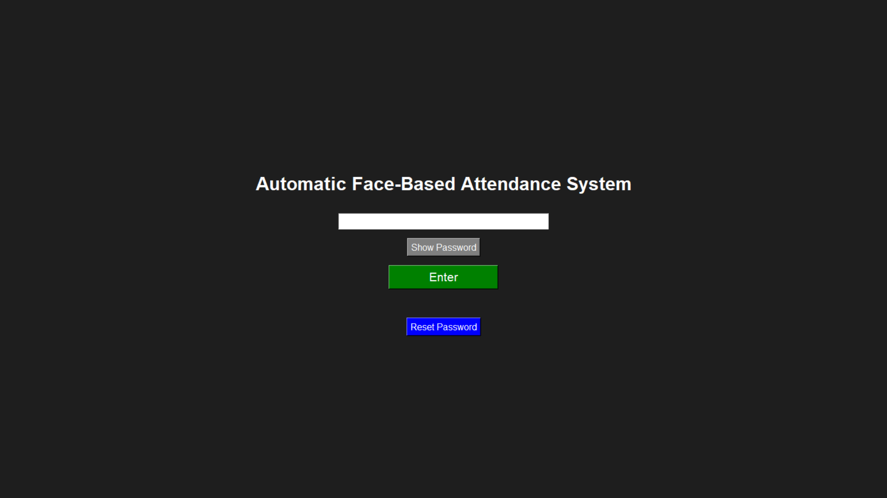
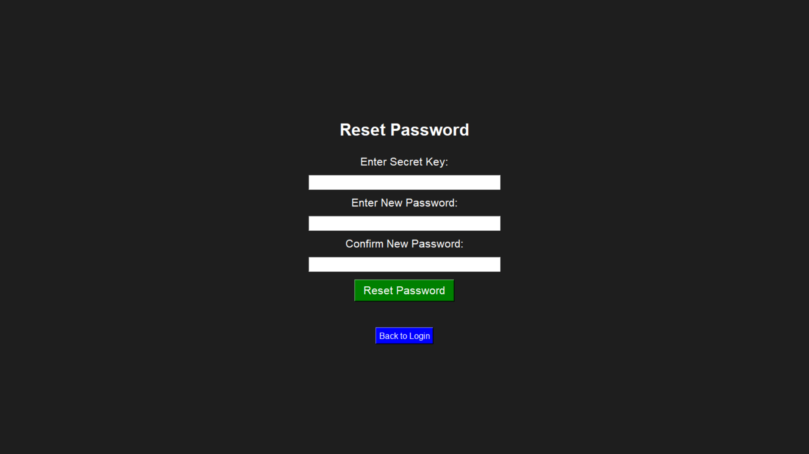

---
# Automatic Face Attendance System

A compact, offline, face recognition-based attendance system built with Python, OpenCV, dlib, and Tkinter. Designed to automate and simplify attendance management in classrooms, especially for offline or low-connectivity environments.

## Features

- Raspberry Pi Compatible: Lightweight, portable, and cost-effective. Works perfectly on Raspberry Pi 4 Model B.
- Face Recognition using dlib (128D Facial Features): High accuracy, privacy-focused (no cloud storage).
- Automatic Attendance Marking: Attendance saved in `.xls` files course-wise with timestamps.
- Student Registration UI: Capture multiple face angles and store them locally.
- Course-Wise Attendance Management: Create and manage separate XLS files for each course.
- Email Attendance Files: Directly send attendance reports via email without manual transfer.
- Voice Announcements: Device announces registration numbers of present students for manual cross-verification.
- Auto-Deletion of Images: Enhances privacy by deleting images after feature extraction.
- Basic GUI: Easy-to-use interface built with Tkinter, suitable for non-technical users.
- Offline First: Fully operational without internet except for email sending.

## Project Structure

```
automatic_attendance_system/
│
├── main.py
├── attendance_taker.py
├── features_extraction_to_csv.py
├── get_faces_from_camera_tkinter.py
├── mailing_xls_attendance_file.py
│
├── xls_attendance/
│   ├── __init__.py
│   ├── marking_attendance_in_xls.py
│   ├── voice_call_of_name.py
│   └── xls_file_creator.py
│
├── attendance_record/
│   ├── cs102.xlsx
│   ├── cs201.xlsx
│
├── data/
│   ├── data_dlib/
│   │   ├── dlib_face_recognition_resnet_model_v1.dat
│   │   └── shape_predictor_68_face_landmarks.dat
│   ├── data_faces_from_camera/
│   └── features_all.csv
│
├── .env
├── .env.sample
├── requirements.txt
├── attendance.db
├── .gitignore
└── .gitattributes
```

## Installation

1. Clone the repository
   ```bash
   git clone https://github.com/your-username/automatic_attendance_system.git
   cd automatic_attendance_system
   ```

2. Install the dependencies
   ```bash
   pip install -r requirements.txt
   ```

3. Set up environment variables
   - Copy `.env.sample` to `.env`
   - Fill in your email credentials and basic configurations.

## Usage

1. Run the Main Application
   ```bash
   python main.py
   ```

2. Functionalities Available:
   - Register Student: Capture and save multiple face angles.
   - Take Attendance: Detect faces and mark present students in course-wise XLS.
   - Send Attendance Report: Email attendance file to the specified address.

---
## Screenshots
### Home Page


### Main Page


### Reset Password


### Register Student


### Attendance Taking


### Creating Course


### Sending Mail


---
## Environment Variables (.env)

| Variable            | Description                          |
|---------------------|--------------------------------------|
| EMAIL_SENDER         | Your Gmail/SMTP email address        |
| EMAIL_PASSWORD       | App-specific password for Gmail     |
| SMTP_SERVER          | SMTP server (e.g., smtp.gmail.com)   |
| SMTP_PORT            | SMTP port (e.g., 587)                |

## Unique Highlights

| Feature                          | Our System | Biometric Devices | RFID | Cloud Face Apps |
|-----------------------------------|------------|-------------------|------|-----------------|
| Touchless Face-Based Attendance  | ✅          | ❌                 | ✅    | ✅               |
| Offline Full Functionality        | ✅          | ✅                 | ✅    | ❌               |
| Course-wise XLS Generation        | ✅          | ❌                 | ❌    | Some            |
| Voice Announcement                | ✅          | ❌                 | ❌    | ❌               |
| Secure Local Storage              | ✅          | ✅                 | ✅    | ❌               |
| Real-Time Email Reporting         | ✅          | Manual            | Manual| ✅               |
| Auto-Deletion of Student Images   | ✅          | N/A               | N/A  | ❌               |
| Proxy Prevention (Anti-fraud)     | ✅          | ✅                 | N/A  | N/A             |

## Contributing

Contributions, ideas, and feedback are welcome.  
Feel free to open an Issue or submit a Pull Request.

## License

This project is licensed under the MIT License.

---
